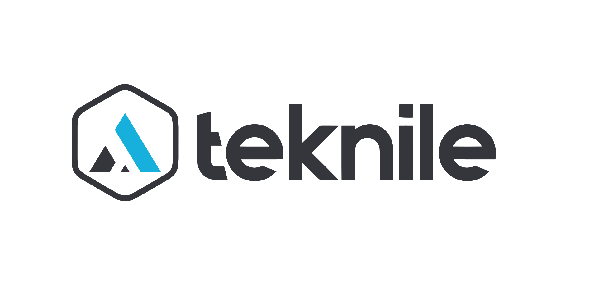

<p align="center"></p>

# EVRe

**Embedded Volatile Register express** — pronounced **"ever"**, because the
registers are always live.

EVRe is a protocol of **teknile**.

A small single-master register protocol for embedded devices, and the tools
around it. One request returns a whole block of mixed-type telemetry — floats,
integers, flags — over any byte link: UART, RS-485, I²C, SPI, USB CDC or TCP.

```
host                                   device
 │   7B 01 AA 00 D0 CC 00 ..            │   READ 204 registers at 0xD000
 ├─────────────────────────────────────►│
 │   7B 01 AB 00 D0 CC 00 <204 B> ..    │   the device's entire state, one reply
 ◄─────────────────────────────────────┤
```

| | |
|---|---|
| Protocol revision | **1** (reported in `STATUS[7:0]`) |
| Device library | C++, two files, no dependencies beyond `stdint` / `stdlib`, ~3 kB of code |
| Host tool | **EVRe Studio**: live registers, charts, CSV, writes, an API for MATLAB / LabVIEW / Python, and a map editor that exports a specification, a C header and a Python module |
| Map format | **`evre-map/1`**: one JSON file describes a device's registers for every tool ([contract](studio/docs/MAP_FORMAT.md), [JSON Schema](studio/docs/evre-map-1.schema.json)) |

## What is here

| Folder | What |
|---|---|
| [`lib/`](lib/) | The device-side library: `EVRe.h`, `EVRe.cpp`. `ports/stm32h7/malloc_lock.c` is an optional heap lock for newlib on Cortex-M7. |
| [`docs/PROTOCOL.md`](docs/PROTOCOL.md) | The protocol: frame, function codes, CRC, register model, reserved bank, messages, errors, test vectors, device API, host notes, conformance checklist. |
| [`studio/`](studio/) | **EVRe Studio**, the desktop tool (C++17, Qt 6). |
| [`studio/docs/MAP_FORMAT.md`](studio/docs/MAP_FORMAT.md) | The register map format `evre-map/1`: the contract for any tool that reads or writes maps, and its [JSON Schema](studio/docs/evre-map-1.schema.json). |
| [`studio/cli/`](studio/cli/) | `evre` (validate, export, info, read, dump, watch, write, check a device against its map) and `evre-sim` (a map served as a device), built with the Studio. |
| [`studio/python/`](studio/python/) | `evre` for Python: a device by register name with its map, standard library only. |
| [`CONTRIBUTING.md`](CONTRIBUTING.md), [`CHANGELOG.md`](CHANGELOG.md) | how to change EVRe, and what each version holds. |
| [`studio/examples/`](studio/examples/) | Using a device from MATLAB, LabVIEW and Python through EVRe Studio. |

## The protocol in one screen

```
7B  SLAVE  FN  OFF_L OFF_H  CNT_L CNT_H  DATA…  CRC_L CRC_H  7D
```

- **A register is one byte.** A `float` is 4 registers, a `uint16_t` 2; lay the
  read-only values out contiguously and one READ returns the whole state.
- Function codes: `AA` READ, `AB` READ_RESP, `EA` WRITE, `EB` WRITE_ACK,
  `EC` WRITE_ACK_RESP, `EE` ERROR_RESP (one error byte).
- CRC-16/X-25 (reflected 0x1021, init 0xFFFF, final XOR 0xFFFF) over
  everything before it; check value of `"123456789"` is `0x906E`.
- Bank `0xA000` is the protocol's own (DEVICE_ID, STATUS, CONFIG, messages);
  bank `0xD000` is the device's.
- The frame carries its own delimiters and CRC, so the same bytes work on
  every link.

Details, test vectors and the device API: [docs/PROTOCOL.md](docs/PROTOCOL.md).

## Device side (quick start)

```c
#include "EVRe.h"

base_t dev;

uint8_t protocolConfigure(base_t *d) {        /* override the weak default */
    d->SALVE_ID_REG = 1;
    d->DEVICE_ID    = 0x2001;
    d->DEVICE_REG_READ_MAX  = 0xD0EC;
    d->DEVICE_REG_WRITE_MIN = 0xD0CC;
    d->D000 = new uint8_t*[(d->DEVICE_REG_READ_MAX + 1) & 0x0FFF];
    uint8_t *p = (uint8_t *) &my_registers;   /* a packed struct */
    for (uint16_t i = 0; i < sizeof(my_registers); ++i) d->D000[i] = &p[i];
    return NO_ERROR;
}

protocolInit(&dev);                            /* once at start-up */

/* whenever a frame arrives */
uint16_t len = 0;
decodePacketInto(&dev, rx, rxLen, txBuf, sizeof(txBuf), &len);
if (len) transmit(txBuf, len);                 /* the reply, or an error frame */
```

Add `lib/EVRe.cpp` to the firmware build and `lib/` to the include path.

## EVRe Studio

A desktop tool for any EVRe device, over TCP or a serial / USB port.

- Live register table from a JSON **device map**: units, bit fields and enum
  names decoded; search, groups; values not refreshed turn grey.
- **Live chart** of any registers, as an oscilloscope: memory depth, Hold / Live,
  cursors, measurements (min, max, mean, RMS, area) and math lines
  (`SUPPLY_V * SUPPLY_I`). Many fast lines at the display's rate: 64 lines of
  1000 Hz at 60 frames a second on a 4K screen, drawn by a dedicated graphics
  card when there is one. **CSV recording** of every poll.
- **Several devices on one link** (RS-485, a gateway): a bus file puts each at
  its slave address; broadcast writes; **auto send** from devices that stream
  their values by themselves.
- **Writes**, read back from the device; registers marked ⚠ ask first; an edit
  whose register changed meanwhile asks before overwriting.
- **API server**: other programs reach the device through the Studio —
  **JSON lines** by register name on port 1220 (`get`, `set`, `stream`, …) and
  an **EVRe pass-through** on port 1219. Only this PC unless allowed; writes
  only when switched on in the Studio.
- **Fast**: device I/O on its own thread, pipelined requests, overlapping
  polls — about 4000 polls/s measured against a fast test device on the same PC.
- Built-in help (F1) and a full reference in
  [studio/docs/STUDIO.md](studio/docs/STUDIO.md).
- Qt 6 and standard C++ (on Windows also Direct3D 11 and DirectComposition,
  part of the system, to draw the chart on a graphics card): built and tested on
  **Windows** (MinGW) and **Linux** (the distribution's Qt 6 packages).

Build and use: [studio/README.md](studio/README.md). A device map is a JSON
file ([format](studio/README.md#device-maps)); `studio/maps/example_device.json` shows
every kind of register (hex identifiers, units, scaling, bit fields, enums, ⚠).

```python
# Python, through EVRe Studio's API (port 1220)
import json, socket
f = socket.create_connection(("127.0.0.1", 1220)).makefile("rw")
f.write(json.dumps({"cmd": "get", "names": ["SUPPLY_V"]}) + "\n"); f.flush()
print(json.loads(f.readline())["values"]["SUPPLY_V"])
```

## Tests

| | |
|---|---|
| `studio/tests/fake_device.py` | A fake EVRe device over TCP, from any map, with moving values. |
| `studio/tests/gui_test.cpp` | EVRe Studio's window driven by QtTest against the fake device: writes, read-back, change-while-editing, ⚠ confirmation, stale values, a bus, auto send, the Map editor, the chart (on a graphics card too). |
| `studio/tests/api_test.py` | The API server end to end, in its three write modes, JSON and pass-through. |
| `studio/tests/map_test.cpp`, `cli_test.py`, `sim_test.py`, `device_table_test.py`, `schema_test.py` | The map files and exports, `evre`, `evre-sim`, the device table compiled with the library, the JSON Schema. |
| `studio/python/tests` | The Python package against `evre-sim`. |
| `studio/tests/evre_probe.cpp` | The Studio's protocol core against a real device, read only. |

## License

EVRe — the protocol, the device library and EVRe Studio — is © **teknile**, licensed under the
[Apache License 2.0](LICENSE): use it in open or closed products, change it, ship it, as long as the license and
the [NOTICE](NOTICE) go with it. The license grants no rights to the names *EVRe* and *teknile*. Every source file
says so in its first line (`SPDX-License-Identifier: Apache-2.0`).

EVRe Studio uses Qt under the LGPLv3 (see NOTICE).
