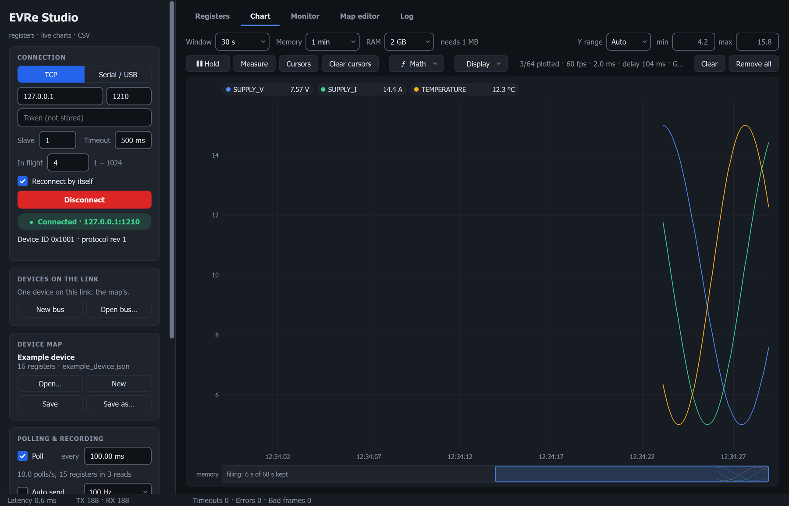

<p align="center">
  <picture>
    <source media="(prefers-color-scheme: dark)" srcset="EVRe/docs/assets/teknile-logo-reversed.svg">
    
  </picture>
</p>

<h1 align="center">EVRe: live registers for embedded devices</h1>

<p align="center">
  <b>One request, the device's whole state.</b> A 3 kB register protocol for microcontrollers,<br>
  and a desktop oscilloscope-style tool that watches, charts, records and drives any device that speaks it.
</p>

<p align="center">
  <a href="https://github.com/turjman/teknile/actions/workflows/ci.yml"></a>
  <a href="LICENSE"></a>
  
  
  
  
</p>

<p align="center">
  <a href="#try-it-in-two-minutes">Try it</a> ·
  <a href="#download">Download</a> ·
  <a href="#evre-studio">EVRe Studio</a> ·
  <a href="#the-protocol-in-one-screen">The protocol</a> ·
  <a href="#your-device-in-20-lines">Your device</a> ·
  <a href="#from-python-matlab-labview-or-a-terminal">Python and CLI</a> ·
  <a href="#documentation">Docs</a>
</p>

<p align="center"></p>

---

## Why EVRe

Every embedded project ends up with the same homemade "read my variables over the serial port" protocol,
and the same throwaway script to look at them. EVRe is that protocol and that tool, done once and done well.

| Principle | What it means for you |
|---|---|
| **A&nbsp;register&nbsp;is&nbsp;one&nbsp;byte** | A `float` is 4 registers, a `bool` is 1. Lay the read-only values out contiguously and one READ returns the whole state: floats, integers and flags, mixed, in one reply. No 16-bit packing, no endianness argument, no one-request-per-type. |
| **Any&nbsp;byte&nbsp;link** | The frame carries its own delimiters and CRC-16, so the same bytes work over UART, RS-485, I²C, SPI, USB CDC or TCP. Several devices share one link by slave address; broadcast reaches them all. |
| **Tiny&nbsp;on&nbsp;the&nbsp;device** | Two C++ files, no dependencies beyond `stdint` / `stdlib`, about 3 kB of code, heap optional. Field-proven: in production across 100+ devices since 2023. |
| **One&nbsp;map,&nbsp;every&nbsp;tool** | A JSON device map (`evre-map/1`) names each register, its type, unit, scale, limits, bit fields and value names. The Studio, the command line, Python and the exports all read the same file. |
| **A&nbsp;real&nbsp;instrument** | EVRe Studio is an oscilloscope for your registers: cursors, measurements, math lines, lanes, triggers, spectra, CSV recording, and 64 lines at 1000 Hz drawn at 60 fps on a 4K screen by the graphics card. |
| **Safe&nbsp;by&nbsp;default** | Writes are off until you allow them, dangerous registers ask first, a value that changed while you were editing asks first, and every write is read back so the table shows what the device really holds. |

## Try it in two minutes

No hardware needed: a fake device in Python plays the example map, and the Studio connects to it.

**1. Get the Studio.** Download it from [Releases](#download), or build it (Qt 6.5+ with Widgets, Network,
SerialPort, Test and the Linguist tools; CMake 3.21+; a C++17 compiler):

```sh
cmake -S EVRe/studio -B build -G Ninja -DCMAKE_BUILD_TYPE=Release
cmake --build build
```

**2. Start the fake device** (standard library only, no install):

```sh
python3 EVRe/studio/tests/fake_device.py          # the example device on 127.0.0.1:1210
```

**3. Connect, with two lines already on the chart:**

```sh
EVRE_TOKEN=example-token build/EVReStudio --tcp 127.0.0.1:1210 \
    --map build/maps/example_device.json --plot SUPPLY_V,SUPPLY_I --tab chart --connect
```

The pill turns green, the device ID appears under it, the Registers tab fills with live decoded values and the
Chart tab is already running. Press **F1** for the built-in help. Windows notes and every option:
[EVRe Studio's README](EVRe/studio/README.md).

## Download

Every version ships ready to run on the [Releases](https://github.com/turjman/teknile/releases) page:

| File | What it is |
|---|---|
| `EVReStudio-<version>-setup.exe` | Windows installer: for you alone, no administrator needed, Start menu entry, uninstaller |
| `EVReStudio-<version>-windows.zip` | The same, portable: unzip and run `EVReStudio.exe` |
| `EVReStudio-<version>-x86_64.AppImage` | Linux: make it executable and run it |
| `evre-tools-<version>-linux-x86_64.tar.gz` | The command-line tools `evre` and `evre-sim` for Linux |

The Windows installer and the zip hold the command-line tools and the example map beside the Studio.

## What is inside

| Part | What it is |
|---|---|
| **[EVRe&nbsp;protocol](EVRe/docs/PROTOCOL.md)** | A small single-master register protocol: frames, function codes, CRC-16/X-25, the register model, a reserved bank for the protocol's own registers, messages, errors, broadcast, device-initiated streaming (auto send), test vectors and a conformance checklist. |
| **[Device&nbsp;library](EVRe/lib/)** | `EVRe.h` and `EVRe.cpp`: the device side in two files, with a port note for newlib on Cortex-M7. |
| **[EVRe&nbsp;Studio](EVRe/studio/)** | The desktop tool (C++17, Qt 6, Windows and Linux): live registers, safe writes, the chart, measurements and analysis, recordings, a map editor with exports, several devices on one bus, and an API for other programs. |
| **[Map&nbsp;format](EVRe/studio/docs/MAP_FORMAT.md)** | `evre-map/1`: one JSON file describes a device's registers for every tool, with a [JSON Schema](EVRe/studio/docs/evre-map-1.schema.json). Overlays change a base map in a small file of their own. |
| **[Command&nbsp;line](EVRe/studio/cli/)** | `evre`: validate and export maps, read, dump, watch, write, broadcast, and check a device against its map, from a terminal or CI. `evre-sim`: any map served as a device over TCP. |
| **[Python&nbsp;package](EVRe/studio/python/)** | A device by register name with its map, standard library only; a bus of devices too. |
| **[Examples](EVRe/studio/examples/)** | A device driven from MATLAB, LabVIEW and Python through the Studio's API. |

## EVRe Studio

A JSON map tells the Studio what the device holds; the Studio does the rest.

**See the device**

- A live register table with units, decoded bit fields and enum names, search and group filters, the raw bytes
  and the value's age in a tooltip. Changed values glow; values that stop refreshing turn grey.
- A datasheet-style bit view for quick writes: click a bit or a field, the Studio does the read-modify-write.
- A frame monitor that shows every byte sent and received, and a log of every event, in a tab and a daily file.

**Chart it like an oscilloscope**

- Memory depth apart from the view, Hold / Live, a memory strip, cursors A and B, Auto, Manual or Log Y,
  Normalise, hover values of every line beside the mouse, and smooth scrolling paced by the display's refresh.
- Lanes: one plot per unit, each with its own Y range; they scroll and fold when there are many.
- Measurements per line: value at A and B, B - A, min, max, mean, RMS, standard deviation, peak to peak, the area
  under the line (W to J and Wh, A to A·s and Ah) and running totals since Clear.
- Math lines over registers (`SUPPLY_V * SUPPLY_I`), drawn and measured like any other line, with formula
  completion as you type.
- Analysis: a line's histogram or spectrum (Welch) over A to B in its own window; a trigger that holds the chart
  on a level crossing, Single or Normal.
- Built for many fast lines: binning and drawing on several threads, a RAM budget the samples keep to, and the
  plot drawn by a dedicated graphics card when there is one (Windows, Direct3D 11): 64 lines of 1000 Hz at
  60 frames a second on a 4K screen.
- Fast streams (Fast EVRe): a device sends samples taken on its own clock, up to a million a second, in numbered
  blocks nobody asked for; the Studio starts and stops them from a card, plots every record at its own time (an
  hour down to 10 us in one view, a spike of one record in millions still visible), measures and triggers on them,
  and records them beside the CSV as they came (`.evrs`). The device side is `lib/fast`, a header beside the
  library; the protocol itself is unchanged.

**Record and replay**

- CSV recording of every poll, or of every frame with auto send; the view or A to B exported to CSV; pictures of
  the chart; notes pinned to a moment.
- A recording opens in a window of its own, with its chart, measurements, notes and math lines, while the live
  chart goes on.

**Write safely**

- Writes only with *Allow writes* on; registers marked `danger` ask first; a value that changed while you were
  editing asks first; limits from the map; every write read back from the device.

**Make the map without touching JSON**

- The Map editor: a table edited in place, bulk edits, copy and paste between maps, undo and redo, bit fields and
  value names on a bit strip, limits, defaults, special values, notes, live checks, and a live preview of the
  device's value as you define it. A save changes the file only where it was edited.
- Exports for the people and programs around the device: a Markdown specification with ASCII bit diagrams, a C
  header, a Python module, CSV, and a device table for firmware on the EVRe library (packed register images with
  their addresses checked at compile time).

**Many devices, many programs**

- Several devices on one link (RS-485, a gateway): a bus file puts each at its slave address, their registers
  are named after them (`D1_SPEED`, `D2_STATUS`), a device that stops answering goes offline without slowing the
  others, and broadcast writes read back from each.
- Auto send: a device that can streams its read-only block by itself at 40 to 4000 frames a second; each frame
  is one chart point and one CSV row.
- An API for everything else: JSON lines by register name on port 1220 (`get`, `set`, `stream`), and an EVRe
  pass-through on port 1219 for existing EVRe code. Local only unless you allow the network; writes only when
  switched on in the Studio.
- Fast: all device I/O on its own thread with a high-resolution poll clock, registers merged into block reads,
  pipelined requests. About 4000 polls a second against the fast test device on the same computer.

**In your language**

- English and Arabic (right to left; the chart, numbers, units and register names stay left to right), the Help
  pages included. Dark and light themes.

## The protocol in one screen

```
host                                                     device
  |   7B 01 AA 00 D0 CC 00 .. CRC 7D                       |   READ 204 registers at 0xD000
  |------------------------------------------------------->|
  |   7B 01 AB 00 D0 CC 00 <204 bytes> CRC 7D              |   the device's entire state, one reply
  |<-------------------------------------------------------|
```

```
+----+-------+----+-------+-------+-------+-------+----------+-------+-------+----+
| 7B | SLAVE | FN | OFF_L | OFF_H | CNT_L | CNT_H | DATA ... | CRC_L | CRC_H | 7D |
+----+-------+----+-------+-------+-------+-------+----------+-------+-------+----+
```

| Item | Value |
|---|---|
| **Function&nbsp;codes** | `AA` READ, `AB` READ_RESP, `EA` WRITE, `EB` WRITE_ACK, `EC` WRITE_ACK_RESP, `EE` ERROR_RESP (one error byte) |
| **CRC** | CRC-16/X-25 (reflected 0x1021, init 0xFFFF, final XOR 0xFFFF) over everything before it; the check value of `"123456789"` is `0x906E` |
| **Banks** | `0xA000` is the protocol's own (DEVICE_ID, STATUS, CONFIG, messages); `0xD000` is the device's |
| **Addressing** | Slave 1 to 255 on one link; slave 0 is the broadcast address |
| **Revision** | 1, reported in `STATUS[7:0]`; capability bits say what the device can do (error frames, broadcast, messages, auto send, DFU) |

Frames, errors, test vectors, the device API and the conformance checklist: [PROTOCOL.md](EVRe/docs/PROTOCOL.md).

## Your device in 20 lines

Add `EVRe/lib/EVRe.cpp` to the firmware build and `EVRe/lib/` to the include path. Point the library at a packed
struct, and every variable in it is a live register:

```cpp
#include "EVRe.h"

base_t dev;

uint8_t protocolConfigure(base_t *d) {        /* override the weak default */
    d->SALVE_ID_REG = 1;
    d->DEVICE_ID    = 0x2001;
    d->DEVICE_REG_READ_MAX  = 0xD0EC;
    d->DEVICE_REG_WRITE_MIN = 0xD0CC;
    d->D000 = new uint8_t*[(d->DEVICE_REG_READ_MAX + 1) & 0x0FFF];
    uint8_t *p = (uint8_t *) &my_registers;   /* a packed struct */
    for (uint16_t i = 0; i < sizeof(my_registers); ++i) d->D000[i] = &p[i];
    return NO_ERROR;
}

protocolInit(&dev);                            /* once at start-up */

/* whenever a frame arrives */
uint16_t len = 0;
decodePacketInto(&dev, rx, rxLen, txBuf, sizeof(txBuf), &len);
if (len) transmit(txBuf, len);                 /* the reply, or an error frame */
```

Or let the Studio write that part: export the map as a **device table** (`evre export map.json --to table`) and
get the packed register images, their offsets checked at compile time, the defaults as start values and the
function that serves them.

## From Python, MATLAB, LabVIEW or a terminal

**Python**, by register name, standard library only (`pip install ./EVRe/studio/python`):

```python
import evre

with evre.connect_tcp('127.0.0.1', 1210, 'maps/example_device.json', token='example-token') as dev:
    print(dev['SUPPLY_V'])                 # 12.031  (raw x scale + offset, in the map's unit)
    print(dev.decoded('STATE'))            # {'MODE': 'run', 'READY': 1, 'ALARM': 0}
    dev['LED_MODE'] = 'blink'              # a value name, a number, a shown value
    print(dev.write('FAN_SPEED', 40))      # 40: written, then read back
```

**The command line**, from a shell or a CI job:

```sh
evre validate maps/*.json                                     # every map checked against the format
evre export maps/example_device.json --to md -o device.md     # a specification; also h, py, csv, table
evre watch --tcp 192.168.1.20:1210 --map maps/example_device.json SUPPLY_V SUPPLY_I
evre write --tcp 192.168.1.20:1210 --map maps/example_device.json FAN_SPEED=40
evre check --tcp 192.168.1.20:1210 --map maps/example_device.json     # does the device match its map?
evre-sim maps/example_device.json --port 1210                 # the map, served as a device
```

**MATLAB, LabVIEW and anything that can open a socket** talk to the Studio's API in JSON lines, one object per
line each way:

```
{"cmd":"get","names":["SUPPLY_V","STATE"]}                fresh values, with the decoded bit fields
{"cmd":"set","values":{"LED_MODE":2}}                     write, then read back
{"cmd":"stream","names":["SUPPLY_V","SUPPLY_I"],"ms":50}  a line every 50 ms
```

Working examples for each: [EVRe/studio/examples](EVRe/studio/examples/).

## Documentation

| Document | What it holds |
|---|---|
| [Protocol](EVRe/docs/PROTOCOL.md) | why it exists, frames, function codes, CRC, the register model, errors, test vectors, the device API, patterns and pitfalls, a conformance checklist |
| [EVRe&nbsp;Studio&nbsp;guide](EVRe/studio/docs/STUDIO.md) | every feature with its screen, the reference (maps, the API, the protocol as the Studio uses it), the internals (threads, the chart renderer), building, tests, the Map editor and exports |
| [Map&nbsp;format](EVRe/studio/docs/MAP_FORMAT.md) | the contract for any tool that reads or writes maps, and its [JSON Schema](EVRe/studio/docs/evre-map-1.schema.json) |
| [Python&nbsp;package](EVRe/studio/python/README.md) | every call of `evre` for Python, devices and buses |
| [Examples](EVRe/studio/examples/README.md) | the API's commands, and a device from MATLAB, LabVIEW and Python |
| [Changelog](EVRe/CHANGELOG.md) | what each version holds |
| [Contributing](EVRe/CONTRIBUTING.md) | how a change is made, tested and documented; how a release is made |

The Studio's own **Help (F1)** holds a short form of the guide, in English and Arabic.

## Tested on every push

Continuous integration builds and tests on **Windows** and **Linux** at every push and pull request:

| Suite | What it covers |
|---|---|
| GUI&nbsp;test | the real window driven by QtTest against the fake device, hundreds of checks: the login, writes and read-back, the Map editor, limits and fields, a bus, broadcast, auto send and the chart |
| Map&nbsp;and&nbsp;schema | the map files saved byte for byte, edits, overlays, the exports (the C header compiled, the Python module imported), the JSON Schema |
| Tools | `evre` end to end against its own fake device and a bus of two; `evre-sim` serving the example map; the device table compiled with the library |
| API&nbsp;and&nbsp;Python | the API server in its three write modes, JSON and pass-through; the Python package against `evre-sim` |

The release workflow builds the installer, the zip, the AppImage and the tools, starts the AppImage under a
virtual display and checks that it draws before anything is published.

## Repository layout

```
EVRe/
  docs/        the protocol and the assets
  lib/         the device library (C++): EVRe.h, EVRe.cpp, ports/
  studio/      EVRe Studio
    src/         the Studio's sources
    cli/         evre and evre-sim
    python/      the evre package for Python
    maps/        example_device.json, example_bus.json
    examples/    MATLAB, LabVIEW and Python through the API
    packaging/   the Windows installer and the Linux AppImage
    translations/ Arabic
    tests/       the fake device, the GUI test and every other test
    docs/        STUDIO.md, MAP_FORMAT.md, the JSON Schema
```

## Contributing

Issues and pull requests are welcome. Read [CONTRIBUTING.md](EVRe/CONTRIBUTING.md) first: every behaviour
change comes with a test and its documentation. Please follow the [Code of Conduct](CODE_OF_CONDUCT.md), and
report security problems as described in [SECURITY.md](SECURITY.md), not in a public issue.

## License

[Apache License 2.0](LICENSE): use it in open or closed products, change it, ship it, as long as the license and
the [NOTICE](EVRe/NOTICE) go with it. EVRe is a protocol of **teknile**; the license grants no rights to the names
*EVRe* and *teknile*. EVRe Studio uses Qt under the LGPLv3 (see NOTICE).
